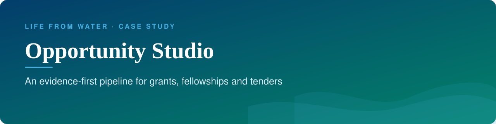
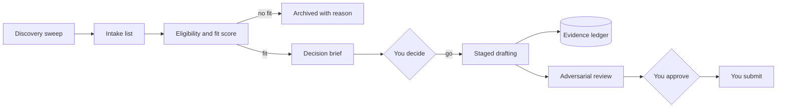

<b>Status:</b> In active internal use &nbsp;·&nbsp; <b>Built by</b> <a href="https://github.com/Mohanad1st">Mohannad Hesham</a> &nbsp;·&nbsp; <b>Source:</b> private

> **This is a showcase, not the code.** The source is private because it holds a live funding pipeline. This page shows what it does and how it was built, not the code itself. A live walkthrough is available on request.

## The problem

Tracking, verifying and drafting dozens of live funding calls by hand, alongside running an organisation, means good opportunities get missed and drafts get rushed. This is the working pipeline behind Life From Water's applications: an AI-assisted workflow that finds, checks, scores and drafts — with every claim traced to a source and a person approving each stage.

## What it does

- A weekly briefing of active opportunities and deadlines in the next 14 and 30 days
- Discovery sweeps that add new, relevant calls to an intake list
- An eligibility check, a fit score out of 100 and a decision brief for each opportunity
- An evidence ledger tracing every factual claim in a proposal back to a source
- Staged drafting with human approval checkpoints, and a tough review pass before anything is final

## See it

How the work flows:

There are no screens: it is a document workflow, not an app, and its tracker holds live funder data.

## Built with

A structured document workspace driven by an AI coding assistant, with a shared spreadsheet tracker and document storage — deliberately no custom app

## Built responsibly

- Every claim is traced to a verified source or marked unconfirmed — never invented
- Human approval before any draft moves forward or any record changes
- No automatic submission and no automatic outreach
- A cap on how many proposals are in progress at once, to keep quality over volume

## What it deliberately doesn't do

- It never submits anything or contacts a funder on its own.

## More from Life From Water

- [Ameen](https://github.com/Mohanad1st/ameen-showcase) — A finance desk you talk to, built to stop donation money being misfiled
- [LFW HR System](https://github.com/Mohanad1st/lfw-hr-system-showcase) — Attendance, leave, overtime and approvals for a field NGO, in Arabic and English
- [Life From Water — donation platform](https://github.com/Mohanad1st/lifefromwater-website-showcase) — Donations and impact you can check, for a water-access NGO in rural Egypt

---

© 2026 Mohannad Hesham. Showcase text and images only — no source code is published or licensed here. See all my work on <a href="https://github.com/Mohanad1st">my GitHub profile</a> · <a href="https://www.linkedin.com/in/mohannadhesham/">LinkedIn</a>.
