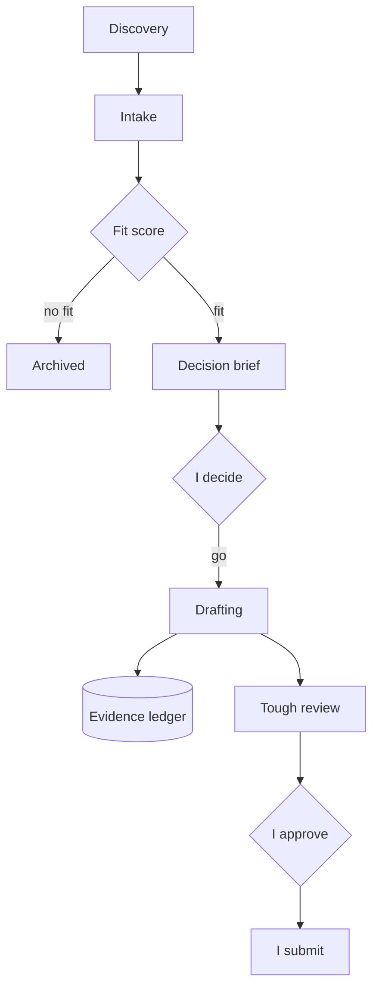

<b>An evidence-first pipeline for grants, fellowships and tenders</b>

<b>Status:</b> In active internal use &nbsp;·&nbsp; <b>Built by</b> <a href="https://github.com/Mohanad1st">Mohannad Hesham</a>

> This is a case study. The source is private because it holds a live funding pipeline.

## Why we built it

Tracking, verifying and drafting dozens of live funding calls by hand, alongside running an organisation, means good opportunities get missed and drafts get rushed. This is the pipeline behind Life From Water's applications and my own: an AI-assisted workflow that finds, checks, scores and drafts. Every claim is traced to a source or marked unconfirmed, and a person approves each stage.

## What it does

- A weekly briefing of active opportunities and deadlines in the next 14 and 30 days.
- Discovery sweeps that add new, relevant calls to an intake list.
- An eligibility check, a fit score out of 100 and a decision brief for each opportunity.
- An evidence ledger that traces every factual claim in a proposal back to a source.
- Staged drafting with human approval checkpoints, and a tough review pass before anything is final.

## How it works

There are no screens: it&#x27;s a document workflow, not an app, and its tracker holds live funder data.

## What it's built on

A structured document workspace driven by an AI coding assistant, with a shared spreadsheet tracker and document storage. There is no custom app, on purpose.

## Safeguards

- Every claim is traced to a verified source or explicitly marked unconfirmed.
- Human approval before any draft moves forward or any record changes.
- No automatic submission and no automatic outreach.
- A cap on how many proposals are in progress at once, to keep quality over volume.

## What it doesn't do

- It never submits anything or contacts a funder on its own.

## More from Life From Water

- [Ameen](https://github.com/Mohanad1st/ameen-showcase) — A finance desk you talk to, built to stop donation money being misfiled
- [LFW HR System](https://github.com/Mohanad1st/lfw-hr-system-showcase) — Attendance, leave, overtime and approvals for our field staff, in Arabic and English
- [WaterEye](https://github.com/Mohanad1st/watereye-showcase) — Read an analogue pressure or flow gauge from a photo, with no smart meter
- [Life From Water: donation platform](https://github.com/Mohanad1st/lifefromwater-website-showcase) — A donation platform in the making, with impact you can check, for our water-access work in rural Egypt

---

© 2026 Mohannad Hesham. Showcase text and images only — no source code is published or licensed here. See all my work on <a href="https://github.com/Mohanad1st">my GitHub profile</a> · <a href="https://www.linkedin.com/in/mohannadhesham/">LinkedIn</a>.
